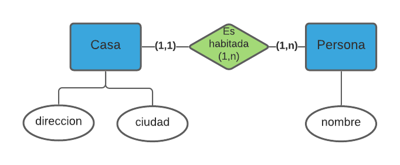
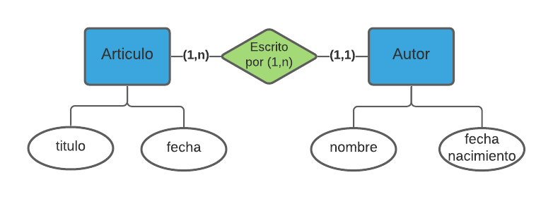

# ¿Cómo construir tu base de datos relacional? 
###### 20/10/2021 - D. Chacón Ocariz

SQL (por sus siglas en inglés Structured Query Language) es el lenguaje utilizado para crear, modificar y acceder la información de las bases de datos relacionales.  

Es un lenguaje declarativo de alto nivel, es decir que, especificamos qué es lo que queremos y no cómo conseguirlo. Esto supone una manera particular de pensar al momento de resolver problemas con este lenguaje.

## ¿Por qué es importante aprender SQL? 

Vivimos en un mundo donde a cada instante se producen más y más datos. Esta información debe ser almacenada en algún lugar para luego ser tratada, visualizada, analizada... 

Las bases de datos relacionales son sistemas que nos permiten almacenar y manipular datos siguiendo el modelo relacional. Esto se logra a través del lenguaje SQL. Entre otras cosas, el SQL sirve para *hacerle preguntas* a una base de datos y obtener la información que deseamos.

Y aunque el SQL sea característico de las bases de datos relacionales, comprenderlo también nos ayuda en la utilización y manipulación de bases de datos *not-only SQL*. 

Así que si te dedicas al desarrollo de aplicaciones, la ciencia de datos, o incluso si eres gerente o te dedicas al marketing (en general, si en tu trabajo manipulas datos), saber SQL te será de gran utilidad. Te ayudará a simplificar tu trabajo y te ahorrará tiempo, además de poder manipular cientos de miles o incluso millones de datos, con una sola instrucción y en relativamente poco tiempo.

En este artículo y el siguiente, quiero enseñarte un método para que comprendas cómo hacer consultas con SQL a partir de un modelo relacional y de preguntas en lenguaje corriente. 

## El Modelo Entidad-Relación

El **Modelo Entidad-Relación** (ER) se basa en una percepción del mundo real donde hay objetos básicos (**Entidades**) que se relacionan entre sí (**Relaciones**). Es una herramienta que se utiliza para el modelado de datos.

**Entidad:** Representa una *cosa*, *objeto* o *concepto* del mundo real con existencia independiente. Es un objeto sobre el que queremos almacenar información. Ejemplo: Un empleado, un departamento, una cuenta bancaria, una receta, un ingrediente, un artículo, un automóvil, un animal...

**Atributos:** Los atributos son las características que definen a una entidad.

Una entidad está descrita y se representa por sus características o atributos. Por ejemplo: 

1. La entidad Persona tiene como características: Nombre, Apellido, Fecha de nacimiento, etc. 
2. La entidad Empleado tiene como características: Nombre, Apellido, Profesión, Puesto en la empresa, etc. 
3. La entidad Artículo tiene como características: Título, Fecha de publicación, Resumen, etc.

Lo que hace única una entidad son los valores específicos de sus atributos, por ejemplo: Pedro Pérez y María González son entidades de tipo Persona.

**Relación:** Es la asociación entre entidades. Refleja las interacciones existentes entre ellas. Se describe a través de verbos: Vive en, Trabaja en, Está formado por, Realiza,...

**Cardinalidad de las relaciones:** Cardinalidad es el número de entidades con los cuales otra entidad puede asociarse. Puede ser: Cero a uno, cero a muchos, uno a uno, uno a muchos o muchos a uno, muchos a muchos:

*0* si cada instancia de la entidad no está obligada a participar en la relación.
*1* si toda instancia de la entidad está obligada a participar en la relación y, además, solamente participa una vez.
*N* o *M* si cada instancia de la entidad puede participar cualquier número de veces dentro de la relación (también se puede representar como N:M) 

Algunos ejemplos de modelos ER y su representación gráfica:

1. Una *Casa* *es habitada* por una o varias *Personas*. Persona y Casa son **entidades**. *Es habitada* es la **relación** que las une: 

<figure>
    
    <figcaption class="titulo-img">Modelo ER Persona - Casa</figcaption>
</figure>
   
2. El *Artículo* de un blog *es ecrito* por un *Autor*. Un Autor puede escribir muchos Artículos. Un artículo es escrito por un autor. Artículo y Autor son las entidades. Escribir es el verbo que describe la relación

<figure>
    
    <figcaption class="titulo-img">Modelo ER Artículo - Autor</figcaption>
</figure>

3. Una *Receta* de cocina *contiene* varios ingredientes. Un mismo *Ingrediente* puede formar parte de varias Recetas

<figure>
    
    <figcaption class="titulo-img">Modelo ER Receta - Ingrediente</figcaption>
</figure>

Estos ejemplos son descripciones de situaciones de la vida real. Prácticamente cualquier situación puede representarse de esta manera. 

Pero ¿por qué es importante conocer el modelo ER? A partir de este modelo, se crean las estructuras de las bases de datos. Conocer la estructura de la base con la que trabajamos, nos facilita la escritura de consultas con SQL.

## ¿Cómo pasar del modelo ER a tablas de una base de datos relacional?

Una base de datos está formada principalmente por tablas que a su vez, están formadas por filas y columnas. Puedes imaginar una tabla igual a una hoja de Excel. 

La información que contiene una tabla de una base de datos, es información que está relacionada entre sí. **Una tabla de una base de datos corresponte a una entidad del modelo ER**.

1. Cada registro de una tabla (fila) constituye un individuo o miembro de una entidad. 
2. Las columnas son los atributos o campos que contienen la información específica de un registro. 
3. Cada registro posee además un identificador único (ID) que llamamos *clave primaria*. La clave primaria es la que permite *relacionar* los registros de diferentes tablas.

En cuanto a las relaciones del modelo ER, las tratamos según su tipo:

1. Las relaciones *0 a 1*, *1 a 1*, *0 a n* ó *1 a n*, se traducen por la inclusión de un atributo o columna suplementaria en la tabla hija que contiene la clave primaria del registro padre. A esta columna de la tabla hija, se le llama *clave foránea*
2. Las relaciones m a n, se traducen en una nueva tabla que contien al menos las claves primarias de las tablas relacionadas

Así, al traducir los ejemplos anteriores de modelos ER, obtenemos los siguientes esquemas de bases de datos:

<figure>
    
    <figcaption class="titulo-img">Tablas base Casas</figcaption>
</figure>

<figure>
    
    <figcaption class="titulo-img">Tablas base Artículos</figcaption>
</figure>

<figure>
    
    <figcaption class="titulo-img">Tablas base Recetas</figcaption>
</figure>

Cada entidad corresponde a una tabla. 

En los 2 primeros casos, la relación se traduce por una columna suplementaria en la tabla hija y que corresponde a la calve primaria (identificador único) de la entidad padre.

En el tercer caso, al tratarse de una relación *muchos a muchos*, la relación se traduce por una tabla suplementaria, donde están al menos las claves primarias de las 2 entidades relacionadas.

## Y en la práctica ¿cómo hacemos?

1. Comienza reflexionando y creando tu modelo entidad-relación. Existen muchas herramientas que te pueden ayudar, como <a href="https://www.lucidchart.com/pages/" target="_blank">Lucidchart</a> o <a href="https://erdplus.com/" target="_blank">ERDPlus</a> que oncluso pueden generar las instrucciones SQL necesarias para crear tu base de datos. Te permiten conectarte a algunos de los gestores de bases de datos más importantes como MySQL, Oracle, PostgreSQL... para ejecutar las modificaciones de tu esquema o recuperar el esquema existente
2. Si no tienes un gestor de base de datos, utiliza SQLite, que es liviano y gratuito, ideal para practicar o incluso para utilizar en pequeñas aplicaciones
3. Utiliza un IDE como <a href="https://dbeaver.io/" target="_blank">DBeaver</a> para conectarte a tu base de datos existente y recuperar su diagrama, modificar o crear nuevas tables, ejecutar consultas, importar y exportar datos, etc.
4. Cuando ya domines mejor el SQL, podrás utilizar la consola directamente para manipular tu base de datos

## Conclusión:

Las bases de datos se utilizan para almacenar y gestionar información. Pero la información no debe almacenarse de cualquier manera. Utilizamos el Modelo Entidad-Relación para plasmar una parte del mundo real y traducirlo en tablas, registros y atributos de una base de datos.

Muchas veces los problemas de performance, corrupción de datos o la dificultad para extraerlos, son consecuencia de un mal diseño de la base. Por eso, es importante tomarse el tiempo de reflexionar y crear un buen modelo desde el comienzo de la aplicación. Existe suficiente documentación y personas que pueden ayudarte en esta tarea.

Tener un esquema de las tablas y relaciones de tu base de datos, te permitirá comprobar el funcionamiento de tu negocio y te facilitará la realización de consultas SQL, ya que sabrás qué tipo de información tienes almacenada, en qué tablas se encuentra y la mejor manera de acceder a ella.

En el próximo artículo, entraremos de lleno en la escritura de consultas con SQL, a partir de preguntas funcionales.

## Artículos relacionados: 

[¿Cómo hacer consultas con SQL?](/blog/como-hacer-consultas-sql)