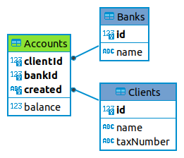

# ¿Cómo hacer consultas con SQL? Parte II: Ejemplos de consultas

Cuando tienes una base de datos relacional y deseas hacer una consulta, debes utilizar la instrucción **SELECT**.

Una instrucción SELECT en SQL permite extraer datos de una o varias tablas de una base de datos relacional. En vista de que el lenguaje SQL es un lenguaje declarativo, la instrucción SELECT lo que hace es especificar el resultado que queremos obtener, y no la manera cómo lo vamos a obtener. Es el motor de la base de datos el que se encarga de crear el mejor plan de ejecución posible para poder obtener el resultado que le pedimos.

La instrucción **SELECT** está formada por varias partes o cláusulas, algunas obligatorias y otras opcionales, que deben seguir un orden específico y que responden cada una a una pregunta específica:

1. Las cláusulas **SELECT** y **FROM** son obligatorias. Lo mínimo que necesitas para hacer una consulta es indicar los datos que deseas y en qué tablas se encuentran. En la cláusula FROM especificas también los **JOIN**, es decir, la manera cómo vas a unir las tablas para poder obtener la información que deseas
2. La cláusula **WHERE** te permite indicar las condiciones para filtrar los datos de las tablas
3. En ocasiones necesitas funciones de agregación: **SUM, AVG, COUNT**… para obtener la suma, el promedio, la cantidad de registros, etc. de una columna. La cláusula **GROUP BY** te permite indicar las columnas por las que vas a agrupar los datos para calcular las funciones de agregación. Y la cláusula **HAVING** la puedes comparar con WHERE, pero para aplicar condiciones sobre las columnas calculadas con las funciones de agregación
4. **ORDER BY** te indica las columnas por las que quieres organizar el resultado. Por defecto el orden es ascendente
5. Y la cláusula **LIMIT** la puedes utilizar para limitar la cantidad de registros que deseas obtener. Generalmente la utilizas bases de datos con una gran cantidad de registros y no necesitas tenerlos todos

En resumen, al construir una consulta SELECT, puedes guiarte por las siguientes preguntas:

- ¿Qué información necesito?: **SELECT** 
- ¿En cuál(es) tabla(s) se encuentra?: **FROM** 
- ¿Qué condiciones deben cumplir los registros? *WHERE* 
- ¿Por cuál información voy a agrupar los datos? *GROUP BY*
- ¿Qué condición deben cumplir los datos agrupados? *HAVING* 
- ¿Cuál será el orden del resultado? *ORDER BY* 
- ¿Cuántos registros necesito? *LIMIT*


## Caso de estudio: Clientes bancarios y sus cuentas

Me pasaron estos ejercicios para resolverlos con Javascript. Son excelentes para practicar con arreglos y objetos, pero sin duda son muy buenos también para practicar SQL (la prueba de que siempre hay muchas maneras de solucionar un mismo problema).

Comencemos por hablar del negocio:

Se trata de una base de datos relacional que almacena información sobre bancos, sus clientes y las transacciones que éstos realizan.

Un banco posee n clientes. Un cliente puede realizar varias transacciones en varios bancos. Se trata de una relación “muchos a muchos” que se traduce en 3 tablas a nivel de la base de datos:

<figure>
    
    <figcaption class="titulo-img">Clientes y sus transacciones bancarias</figcaption>
</figure>

Tener conocimiento del esquema de la base de datos, facilita la escritura de las consultas, pues tienes más claro la información que está almacenada, en cuáles tablas debes buscarla, cuál es la relación entre las tablas…  Si no tienes un esquema de tu base de datos, puedes buscar en Google alguna herramienta que te lo genere. 

Si deseas saber cómo se realiza un esquema de base de datos, te recomiendo la primera parte de este artículo [¿Cómo hacer consultas con SQL? Parte I: Construyendo tu base de datos](/blog/consultas-sql-1).

Aunque el modelo del ejemplo es sencillo, permite realizar una serie de consultas bastante interesantes. Con cada nueva pregunta, iremos aumentando el grado de dificultad.

Aquí en mi [Github](https://github.com/dchaconoca/SQLAlchemy-SQL) puedes descargar la base de datos SQLite para probar los ejemplos. También podrás encontrar allí mismo unos archivos JSON con los datos y una pequeña aplicación en Python que utiliza la librería SQLAlchemy para crear la base de datos e integrar los datos para la prueba.

¡Ahora sí! Vamos a aplicar la teoría que aprendimos más arriba.

### Ejercicio 1: Lista del nombre y número fiscal de todos los clientes ordenados por el número fiscal ascendente:

Como son los primeros ejercicios, podemos guiarnos por la tabla de preguntas, con el tiempo y la práctica seguro lo harás mentalmente.

- ¿Qué información necesito? **SELECT name, taxNumber** 
- ¿En cuál(es) tabla(s) se encuentra? **FROM Clients** 
- ¿Cuál será el orden del resultado? **ORDER BY taxNumber** 

La consulta resultante es entonces:

```
SELECT name, taxNumber 
FROM Clients
ORDER BY taxNumber
```
No tenemos que aplicar ninguna condición WHERE porque queremos todos los registros. Por defecto el orden es ascendente, por eso tampoco hay necesidad de especificarlo.


### Ejercicio 2: Todos los clientes con su saldo total, ordenados por saldo decreciente

El nombre del cliente lo encontramos en la tabla *Clients* pero el saldo lo encontramos en la tabla *Accounts*, por lo tanto utilizamos **JOIN ... ON ...** para indicar cuáles tablas vamos a necesitar y a través de qué campos vamos a hacer el enlace.

El saldo total no se guarda en la base, porque cambia constantemente. Así que debemos calcularlo cada vez que lo necesitamos. Para eso, utilizamos la función **SUM**. Y como debemos hacer el cálculo para cada cliente, debemos indicarlo en la cláusula **GROUP BY**


- ¿Qué información necesito?  **SELECT cl.id, cl.name, sum(ac.balance)** 
- ¿En cuál(es) tabla(s) se encuentra?  **FROM Clients cl JOIN Accounts ac ON cl.id = ac.clientId** 
- ¿Por cuál información voy a agrupar los datos?  **GROUP BY cl.id** 
- ¿Cuál será el orden del resultado?  **ORDER BY sum(ac.balance) DESC** 

```
SELECT cl.id, cl.name, 
  sum(ac.balance)
FROM Clients cl JOIN Accounts ac 
  ON cl.id = ac.clientId
GROUP BY cl.id  
ORDER BY sum(ac.balance) DESC
```

### Ejercicio 3: Bancos con sus clientes y sus taxNumber ordenados por nombre del banco y nombre de los clientes 

En este caso, necesitamos información de las 3 tablas. Utilizamos **DISTINCT**, de lo contrario obtendremos tantas líneas como registros hay en la tabla *Accounts*. Haz la prueba y verás.


- ¿Qué información necesito?  **SELECT DISTINCT bk.name, cl.name, cl.taxNumber** 
- ¿En cuál(es) tabla(s) se encuentra?  **FROM Banks bk JOIN Accounts ac ON bk.id = ac.bankId JOIN Clients cl ON cl.id = ac.clientId** 
- ¿Cuál será el orden del resultado?  **ORDER BY bk.name, cl.name** 

```
SELECT DISTINCT bk.name, 
  cl.name, 
  cl.taxNumber
FROM Banks bk JOIN Accounts ac 
  ON bk.id = ac.bankId 
JOIN Clients cl 
  ON cl.id = ac.clientId
ORDER BY bk.name, cl.name
```

### Ejercicio 4: Clientes del banco Santander con un saldo mayor a 25000 ordenados por saldo decreciente 

Primero que nada, debemos calcular el saldo total para cada cliente, como lo hicimos en el ejercicio 2. Sin embargo, tenemos una condición sobre ese saldo total, pues queremos sólo aquellos clientes cuyo saldo sea mayor de 25000. Para eso, utilizamos la cláusula **HAVING**. Esta cláusula permite indicar condiciones sobre los campos producto de una función de agregación, en este caso **SUM**.

Para facilitar la consulta, utilizamos directamente el ID del banco Santander (ac.bankId = 1) en la cláusula **WHERE** para indicar que sólo queremos los clientes del banco Santander.


- ¿Qué información necesito?  **SELECT cl.id, cl.name, sum(ac.balance)** 
- ¿En cuál(es) tabla(s) se encuentra?  **FROM Clients cl JOIN Accounts ac ON cl.id = ac.clientId** 
- ¿Qué condiciones deben cumplir los registros?  **WHERE ac.bankId = 1** 
- ¿Por cuál información voy a agrupar los datos?  **GROUP BY cl.id** 
- ¿Qué condición deben cumplir los datos agrupados?  **HAVING sum(ac.balance) >= 25000** 
- ¿Cuál será el orden del resultado?  **ORDER BY sum(ac.balance) DESC** 

```
SELECT cl.id, 
  cl.name, 
  sum(ac.balance)
FROM Clients cl JOIN Accounts ac 
  ON cl.id = ac.clientId
WHERE ac.bankId = 1
GROUP BY cl.id 
HAVING sum(ac.balance) >= 25000
ORDER BY sum(ac.balance) DESC
```

**¡Atención!** Lo más importante de esta consulta, es aprender la diferencia entre **WHERE** y **HAVING**. Las 2 cláusulas permiten indicar condiciones o filtros sobre los registros, sin embargo, *WHERE* se aplica directamente a los registros de las tablas, pero *HAVING* sirve para aplicar condiciones sobre las columnas calculadas.


### Ejercicio 5: Bancos con el total de dinero que manejan ordenados crecientemente 

Esta consulta es muy similar a la ya realizada para obtener el saldo total de cada cliente (ejercicio 2, pero en este caso, cambiamos la tabla *Clients* por la tabla *Banks*.

- ¿Qué información necesito?  **SELECT bk.id, bk.name, sum(ac.balance)** 
- ¿En cuál(es) tabla(s) se encuentra?  **FROM Banks bk JOIN Accounts ac ON bk.id = ac.bankId** 
- ¿Por cuál información voy a agrupar los datos?  **GROUP BY bk.id** 
- ¿Cuál será el orden del resultado?  **ORDER BY sum(ac.balance)** 

```
SELECT bk.id, 
  bk.name, 
  sum(ac.balance)
FROM Banks bk JOIN Accounts ac 
  ON bk.id = ac.bankId
GROUP BY bk.id
ORDER BY sum(ac.balance) 
```

### Ejercicio 6: Bancos y sus clientes con el saldo total de cada uno 

Aquí unimos lo ya realizado en los ejercicios 2 y 5. 

```
SELECT bk.name, 
  cl.name, 
  sum(ac.balance)
FROM Banks bk JOIN Accounts ac 
  ON bk.id = ac.bankId
JOIN Clients cl 
  ON ac.clientId = cl.id 
GROUP BY bk.name, cl.name
```

### Ejercicio 7: Bancos con la cantidad de clientes que solo tienen cuenta en ese banco

Para cada banco, contamos la cantidad de clientes distintos que tiene. Excluimos los clientes que tienen cuenta en otro banco (NOT IN subconsulta).

```
SELECT ac.bankId, 
  count(DISTINCT ac.clientId)
FROM Accounts ac
WHERE ac.clientId NOT IN 
  (SELECT ac2.clientId 
  FROM Accounts ac2 
  WHERE ac.bankId <> ac2.bankId)
GROUP BY ac.bankId
```

Analicemos la subconsulta: Estamos buscando los clientes que tienen transacciones en otro banco que no sea el banco de la consulta principal, eso es lo que expresamos con la cláusula **WHERE ac.bankId <> ac2.bankId**. Luego, en la consulta principal, excluimos todos los clientes encontrados en la subconsulta.

Puedes utilizar la siguiente consulta para identificar los clientes que solo tienen una cuenta en un banco:

```
SELECT ac.bankId, 
  ac.clientId
FROM Accounts ac
WHERE ac.clientId NOT IN 
  (SELECT ac2.clientId 
  FROM Accounts ac2 
  WHERE ac.bankId <> ac2.bankId)
GROUP BY ac.bankId
```

### Ejercicio 8: Bancos con el cliente de menor saldo 

Esta consulta debemos hacerla en 2 partes: Una que nos devuelve el saldo total para cada cliente en cada banco y otra parte que selecciona el cliente con el saldo más pequeño.

Aquí te presento 2 soluciones:

#### Solución con una subconsulta:

Podemos utilizar una consulta con una subconsulta. La subconsulta nos devuelve los ID del banco, del cliente y el saldo total de cada cliente en el banco dado.

Luego, la consulta principal selecciona el cliente con el saldo más pequeño (**min(total)**).

```
SELECT bk.name, 
  cl.name, 
  min(total)
FROM Banks bk JOIN 
  (SELECT ac.bankId AS bankId, 
    ac.clientId AS clientId, 
    sum(ac.balance) AS total
  FROM Accounts ac
  GROUP BY ac.bankId, ac.clientId) 
ON bk.id = bankId 
JOIN Clients cl 
  ON clientId = cl.id
GROUP BY bankId 
```

En este caso, la subconsulta la asimilamos a una tabla, por eso la incluimos en un JOIN.

#### Solución con una Vista:

Otra solución es crear una **Vista** con la subconsulta y luego utilizarla dentro de la consulta principal.

```
CREATE VIEW TotalBalanceBankClient AS
  SELECT ac.bankId AS bankId, 
    ac.clientId AS clientId,
    sum(ac.balance) AS total
  FROM Accounts ac
  GROUP BY ac.bankId, ac.clientId
```
```
SELECT bk.name, cl.name, min(tb.total)
FROM Banks bk JOIN TotalBalanceBankClient tb 
  ON bk.id = tb.bankId 
JOIN Clients cl ON tb.clientId = cl.id
GROUP BY tb.bankId 
```

Las vistas son una especie de tablas virtuales que se crean a partir de una consulta SQL. Tienen la ventaja de facilitar la escritura de consultas complejas, haciéndolas más lisibles, comprensibles y reutilizables en varias consultas.

**¿Cuál de las 2 soluciones te parece más sencilla de realizar / comprender?**


## Conclusión:

El SQL es un lenguaje declarativo, es decir, lo que hacemos es indicar el resultado que queremos obtener, luego el motor de la base de datos es el encargado de "decidir" cómo hacer la ejecución.

Conocer el esquema de una base de datos, te facilita la realización de consultas, ya que tienes má claro la información que tienes y en qué tabla se encuentra.

Aquí presentamos solo unos cuantos ejercicios, queda de tu parte seguir practicando y estudiando este maravilloso lenguaje. Aquí te dejo algunos cursos:

- [W3School](https://www.w3schools.com/sql/default.asp)
- [DataCamp](https://www.datacamp.com/search?q=&tab=courses&facets%5Btechnology%5D%5B%5D=SQL)
- [PildorasInformaticas](https://www.youtube.com/playlist?list=PLU8oAlHdN5Bmx-LChV4K3MbHrpZKefNwn)
- [SQL Murder Mystery](https://mystery.knightlab.com/)

## Artículos relacionados: 

[¿Cómo hacer consultas con SQL? Parte I: Construyendo tu base de datos](/blog/consultas-sql-1)
