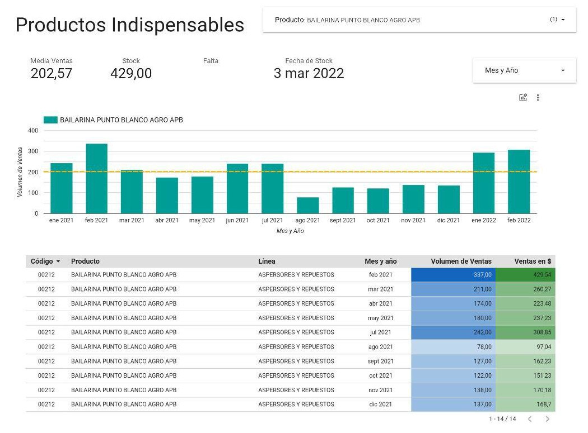

# Análisis de las Ventas de una Ferretería

<figure>
    
    <figcaption class="titulo-img">Reporte Google Data Studio</figcaption>
</figure>

    <strong>Ver código aquí:</strong>
    <a href="https://github.com/dchaconoca/proyecto-ventas" target="_blank" title="Ir a proyecto en GitHub"><i class="fab fa-github-square"></i></a>

 

**Contexto:**

Se trata de estudiar las ventas de una pequeña ferretería a partir del 01/01/2020:

- Empresa pequeña de menos de 10 empleados
- Alrededor de 3000 referencias de productos
- Datos reales a partir de reportes del software de gestión

**Objetivos del Negocio:**

- Analizar objetivamente las ventas
- Identificar los productos indispensables
- Determinar los productos próximos a entrar en rotura de stock 
- Predecir las ventas

**Procedimiento:**

Pasos seguidos para la realización del proyecto:

- Comprensión del problema: Entrevista al usuario para entender sus necesidades y ver la manera en que la ciencia de datos podía ayudar a resolverlo
- Selección de las fuentes de datos: En función del problema a resolver
- Carga, limpieza y transformación de los datos
- EDA: 3 métricas principales: Ventas en $, Volumen de Ventas y N° de Facturas (afluencia de clientes)
- Estudio series temporales (en curso): Con el fin de predecir las ventas

**Resultado:**

    <strong>Ver reporte Google Data Studio aquí:</strong>
    <a href="https://datastudio.google.com/u/0/reporting/a4e9910d-447d-417a-80a9-a1e5ae4a4b22/page/p_hjecb0hysc?s=kHbp4I77DNI" target="_blank" title="Ir al reporte en Google Data Studio"><i class="fas fa-chart-bar"></i></a>

## Tecnologías y herramientas utilizadas:

- *Pandas, Matplotlib, Seaborn, Altair, Squarify.  BeautifulSoup* 
- *Statsmodels, Darts*
- *Jupyter Notebook* 
- *Google Data Studio*
  
