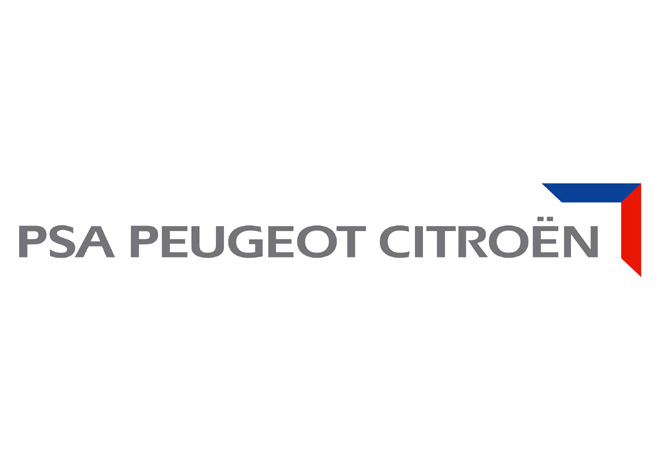

# Experiencia Profesional en PSA Peugeot-Citröen

## Jefe de Proyectos de la aplicación BAMAC (Base de Datos Marketing Clientes)

Conjunto de aplicaciones para las 2 marcas y varios países, encargadas de recopilar, normalizar e integrar datos de diferentes fuentes con la finalidad de ser utilizados por los departamentos de Marketing.

- Análisis de requerimientos de los usuarios, concepción y desarrollo de nuevas funcionalidades
- Mantenimiento de la aplicación
- Conducción de proyectos: Planificación, manejo de
equipo, seguimiento de proyectos, cálculo de
presupuestos

*París-Francia: Junio 2001 - Noviembre 2007*

## Tecnologías utilizadas:

- *Oracle*
- *C*
  