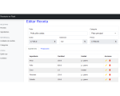

# Recetas de Cocina

 
    <strong>Ver funcionamiento de la aplicación aquí:</strong>
<<<<<<< HEAD
    <a href="https://recetario-flask.herokuapp.com/" target="_blank" title="Ir a proyecto en funcionamiento"><i class="fab fa-python"></i><a>
=======
    <a href="https://recetario-flask.herokuapp.com/" target="_blank" title="Ir a proyecto en funcionamiento">
    
    <a>
>>>>>>> master

    <strong>Ver código aquí:</strong>
    <a href="https://github.com/dchaconoca/Recetario-en-Flask" target="_blank" title="Ir a proyecto en GitHub"><i class="fab fa-github-square"></i><a>

<<<<<<< HEAD
 
Cuando fui a abrir mi restaurant, como todo el mundo que comienza un negocio, me preguntaba cuánto cobrar.

Para eso, me hice en esa época (2009) una pequeña aplicación con Access, donde administraba ingredientes, precios, recetas... Y así calculaba costos y precios.

Ahora construyo de nuevo la aplicación como un ejercicio de Python.

Esta aplicación permite la gestión de recetas de cocina y consta de 2 partes:

1. **Referenciales**: Permite administrar las Categorías de recetas y las Unidades de Medidas de los ingredientes.
2. **Recetario**: Permite administrar las Recetas y los Ingredientes. También calcula de manera automática el precio de la receta en función de los ingredientes.
=======

Cuando fui a abrir mi restaurant, como todo el mundo que comienza un negocio, me preguntaba cuánto cobrar. 

Por esa razón, me hice en esa época (2009) una pequeña aplicación en Access, donde administraba ingredientes, precios, descuentos, impuestos, ganancias, recetas... Y así calculaba costos y precios.

Ahora construyo de nuevo la aplicación como un ejercicio para practicar diversas tecnologías, en particular Python.

Esta aplicación permite la gestión de recetas de cocina y consta de 2 partes:

1. **Recetario**: Permite administrar las Recetas y los Ingredientes. También calcula de manera automática el precio de la receta en función de los ingredientes.
2. **Referenciales**: Permite administrar las Categorías de recetas y las Unidades de Medidas de los ingredientes.
>>>>>>> master

## Tecnologías y modelos utilizados:

- *Flask (Python)*
- *SQL*
- *SQLAlchemy*
- *Jinja / Bootstrap*
- *Modelo MVC* 

## Modelo Entidad-Relación de la aplicación:
