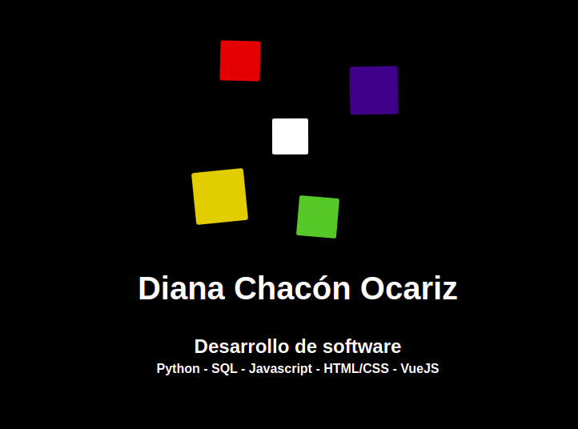

# Mi web site personal

    <strong>Ver código aquí:</strong>
    <a href="https://github.com/dchaconoca/portafolio-vue" target="_blank" title="Ir a proyecto en GitHub"><i class="fab fa-github-square"></i><a>

 
Sitio web que tiene como objetivo mostrar quién soy y mi experiencia como profesional en diversas áreas. 

Ejercicio para practicar desarrollo web front-end responsive.

## Tecnologías utilizadas:

- *VueJS: Vue Cli, Vue Router*
- *Javascript*
- *HTML/CSS: Flexbox, grid, animaciones*
- *Markdown* 
  
